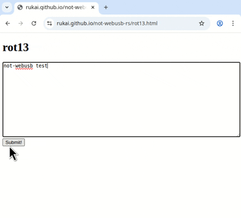

# not-webUSB

[](https://crates.io/crates/not-webusb)
[](https://docs.rs/not-webusb)

An alternative to webUSB for simple usecases with better browser support and the ability to restrict which sites can access the device.

Usage follows a request/response model where the browser JS or wasm sends a request to which the device must send exactly 1 response.

The goal is to be a production ready library for use in real devices.
However, while it works fine for simple use cases, it needs more scrutiny and testing before I would be comfortable using it in production.

not-webusb consists of:

* A [usb-device](https://github.com/rust-embedded-community/usb-device) class implementation that runs on your microcontroller
* Client code for talking to the microcontroller from a website.
  * [sample javascript code](web/not_webusb.js)
  * Or, a rust crate for wasm clients (Not implemented yet)

## Use cases

* not-webusb is well suited for occasional one time operations, with small amounts of data. e.g. flashing key mappings for a keyboard
* Sending large amounts of data is possible but very slow. e.g. firmware updates
* Constant live communication with a device is possible, but poorly suited. e.g. reading sensor data

## Browser support

Unlike webusb which supports only chrome and edge.
not-webusb supports all major browsers, having been tested on:

* Firefox Desktop + Android
* Chrome Desktop + Android
* Edge
* Safari Desktop

## Downsides

Far slower than webusb since it has to go through a lot of overhead with the U2F protocol.
For example, to round trip 5kB of data it takes the following on different browsers:

* linux chrome ~9s
* linux firefox ~13s

Also, most browsers flash the entire window with an alert every time a not-webusb transfer occurs.
<details>
<summary>Expand for GIF of the flashing window on chrome on linux</summary>


</details>

However, on firefox, only a small non-fullscreen box appears instead.

<!--
## Development

Here is a video explaining the development process behind not-webusb.

[](https://youtu.be/9YmU7DN4t2M)
-->

## How does it work though???

not-webusb is built on top of [U2F](https://en.wikipedia.org/wiki/Universal_2nd_Factor) (the legacy part of [FIDO](https://en.wikipedia.org/wiki/FIDO_Alliance)) the protocol for security keys.
However instead of implementing a security key, not-webusb smuggles data through the `application_parameter` and `signature` fields of the `Authenticate` messages sent between the browser and the device.
This is a fundamental part of the protocol and cannot be removed by browsers without rendering large numbers of currently working security keys unusable.

The idea comes from the [I Cant Believe Its Not WebUSB](https://github.com/ArcaneNibble/i-cant-believe-its-not-webusb) demo, which uses the same fields to control an LED from the browser.

## Examples

With a debugger+pico connected, and [probe-rs](https://probe.rs/docs/getting-started/installation) installed, the examples can be run by one of:

* visiting [Github pages](https://rukai.github.io/not-webusb-rs)
* locally running `./serve.sh` and then navigating to [localhost:8000](localhost:8000)

and then following the instructions on the page.

## Cargo Features

* `defmt` - enable defmt logging

## Running integration tests

Install system deps:

```shell
# TODO: confirm which are really needed
sudo apt install ninja-build mercurial python-is-python3 g++-14 libudev-dev
```

Flash the rot13 example firmware to a pico and then run `cargo test`.

## Future work

* Make protocol implementation more robust
  * transaction timeout
  * Remove all possible panic paths
  * Fix demos getting stuck after an exception.
* Internal cleanup
  * Better separate U2F vs CTAP vs user data layers
* I would love for this project to have a recommended webusb implementation of the fido client protocol, allowing browsers with webusb support to avoid the "touch your security key" pop ups, while keeping fido as a fallback protocol. I have no immediate plans to implement this however.
* Improve handling with an actual FIDO key plugged in at the same time.
